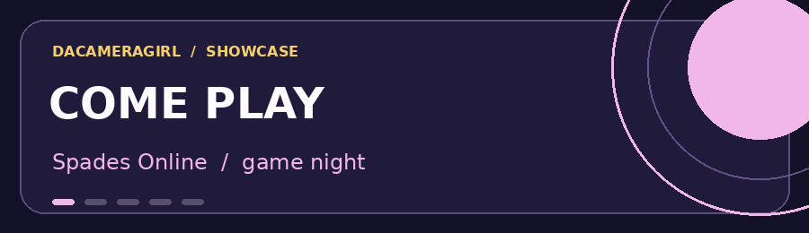

# DaCameraGirl Showcase

**Hi, I'm Angela.** I like turning a “what if?” into something you can click, play, or share. This is my little corner of the internet for the things I've made. You don't need to know anything about code to enjoy it. Pick a card, tap **Live Project**, and have a look around.

### [🎟️ Visit the live showcase](https://dacameragirl-showcase.vercel.app/)

## Start with what sounds fun

### ♠️ [Spades Online](https://spades-online.onrender.com/)

**For game night.** Get friends or family together around a virtual Spades table, even if everybody is in a different place. Choose a name, create a room, share its code, and play. If your crew loves card games and playful trash talk, start here.

**Try it:** Open the game on separate devices and bring people to the same table.

### 🎵 [Music Mash Lab](https://music-mash-lab.onrender.com/)

**For your inner producer.** Pick musical ingredients—styles, sounds, and moods—and see what kind of track they inspire. You can explore combinations and visit the gallery for more ideas. No music theory homework required.

**Try it:** Combine a few favorite sounds and create something unexpected.

### 🎃 [Haunt City](https://dacameragirl.github.io/haunt-city-halloween-heat/)

**For spooky-game people.** Step into Halloween Heat, grab six stashes, dodge No-Face, and race back to the safehouse. This one has atmosphere, candy bombs, and a little bit of trouble waiting for you.

**Try it:** Start the game and see how far you get before the city gets weird.

### ◈ [GLB Factory](https://dacameragirl.github.io/GLB_FACTORY/)

**For makers and curious minds.** Bring a photo into a playful 3D workflow, or visit the mutation lab to make creatures and hybrids. Customize what you create and export a 3D model.

**Try it:** Bring a picture and experiment with making a 3D object.

### ⭐ [Bettin2Win](https://dacameragirl.github.io/Bettin2Win/)

**For anyone baffled by sports odds.** This beginner-friendly guide helps translate odds into understandable numbers, including what a wager could return. It's a learning tool, so you can explore the math before making any real-world decisions.

**Try it:** Change the odds and compare the possible payouts.

## About this little website

The showcase is a single responsive page. Its big cards show real project screenshots where available, with short descriptions and a direct route to the live experience. It is simple to explore on a phone or a computer. Any illustrated card is clearly a preview, not a captured app screen.

Some projects run on free hosting and may need a moment to wake up after they've been idle. If a page takes a little while on the first visit, give it a beat and try again.

## For the curious: how this site is made

This repository contains the complete source for the showcase: `index.html`, `styles.css`, `favicon.svg`, the animated banner, and project screenshots in `assets/`. `make_banner.py` is the source for the GIF. There is no framework, build step, account, or tracking script in the showcase. The projects it links to are independent websites.

To see it locally, open `index.html` in a browser. You can also run `python3 -m http.server 8000` in this folder and open `http://localhost:8000`.

The site is hosted on Vercel from this public GitHub repository. The live apps keep their own homes and their own code. Thanks for stopping by and trying something I made. 💜
